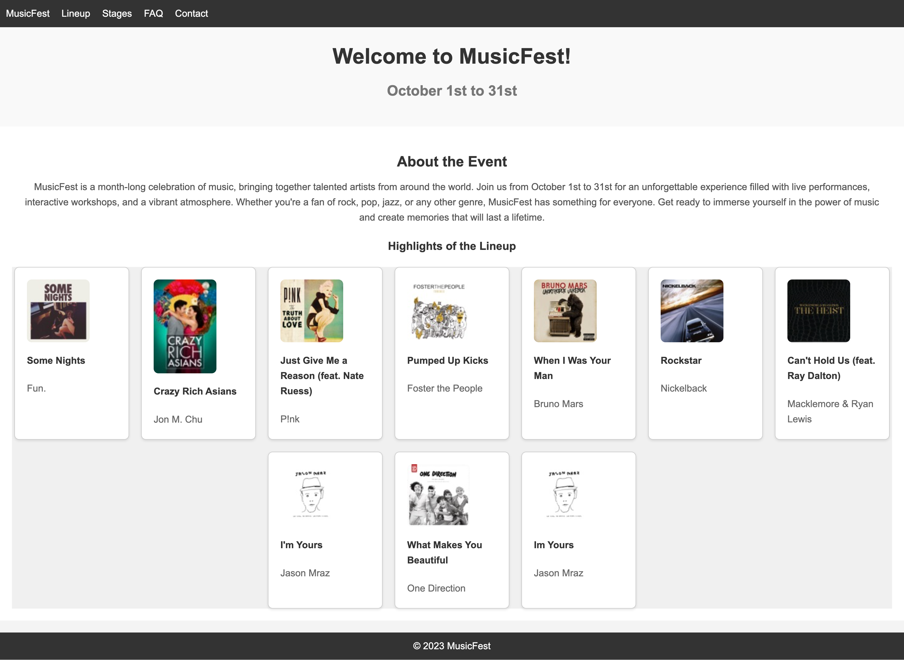
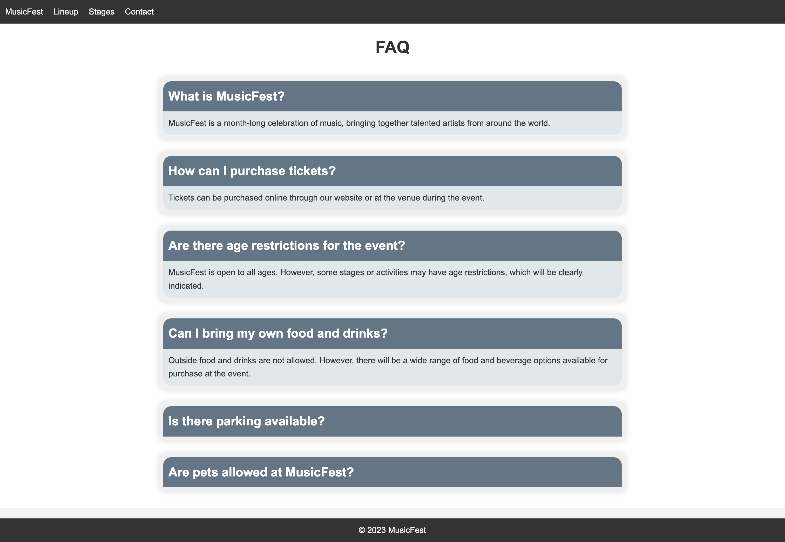
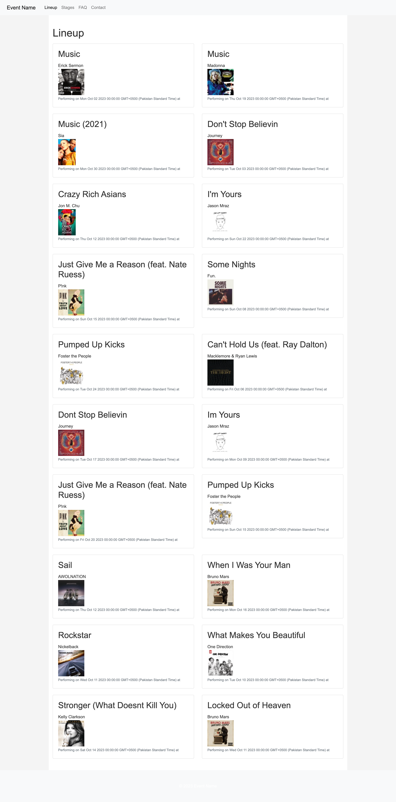
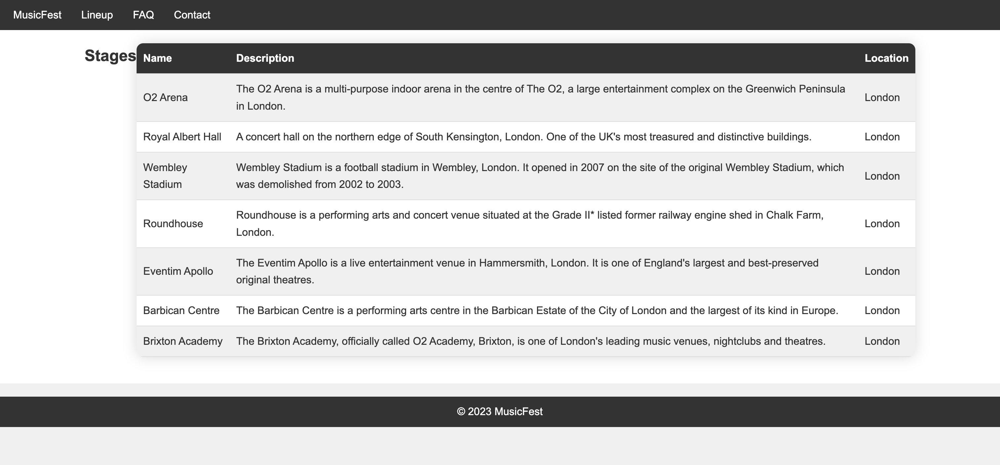
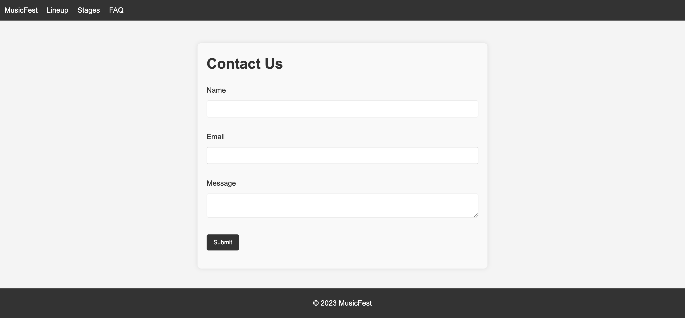

# MusicFest Web Application
This repository contains the source code and documentation for the MusicFest web application, a centralized platform that provides information about a music festival. The application includes features such as lineup details, stages, FAQs, and contact information, delivering a seamless user experience.

## Repository Structure 
The repository follows a typical web application organization with the following directories:

public: Contains subdirectories for CSS, JavaScript, and images.
views: Includes EJS templates for each page, defining the HTML structure and enabling dynamic rendering of data.
routes: Contains JavaScript files that define the routes and request handlers for each page.
models: Includes JavaScript files responsible for data access and manipulation, interacting with the RDS (Relational Database Service) database.
## Technologies Used
The MusicFest web application is built using the following technologies:

Node.js: A JavaScript runtime environment for server-side execution of JavaScript code.
Express.js: A popular web application framework for Node.js, providing features and middleware for routing, request processing, and response generation.
Amazon RDS: A managed relational database service provided by Amazon Web Services (AWS), utilized for storing and retrieving data related to lineup, stages, and other information.
EJS (Embedded JavaScript): A templating language used for dynamic generation of HTML pages, rendering data retrieved from the database.
### Implementation Details
The MusicFest web application includes the following pages:

Homepage (index.ejs): Provides an overview of the festival, dynamically rendering lineup highlights using data obtained from the database.
Lineup Page (lineup.ejs): Displays the complete lineup of artists performing at the music festival, including artist names, descriptions, performance dates, and stage names. Artist images are displayed using the artwork_url attribute.
Stages Page (stages.ejs): Provides information about the different stages at the music festival, presenting stage data in a tabular format with names, descriptions, and locations.
FAQs Page (faq.ejs): Addresses frequently asked questions about the music festival, rendering FAQ data obtained from the server.
Contact Page (contact.ejs): Allows users to get in touch with the event organizers, providing a form for submitting inquiries or messages.

### Images

### Challenges and Future Enhancements
The development process of the MusicFest web application faced the following challenges and proposes future enhancements:

Database Scaling: As the application grows, it is important to consider scaling options for the RDS database to handle increased traffic and data size. This can include options such as vertical scaling (increasing instance size) or horizontal scaling (replication, sharding, or using read replicas).
User Authentication: Implementing user registration, login, and access control would enhance the application's security and enable personalized experiences for users.
Performance Optimization: Various optimizations such as caching frequently accessed data, minimizing database queries, and optimizing client-side scripts and assets can be implemented to improve the application's performance.
### Conclusion
The MusicFest web application provides music festival enthusiasts with a comprehensive platform to access lineup details, stage information, FAQs, and contact information. Built using Node.js, Express.js, Amazon RDS, and EJS, the application delivers a seamless user experience. For more information about the technologies used, please refer to the provided references.

